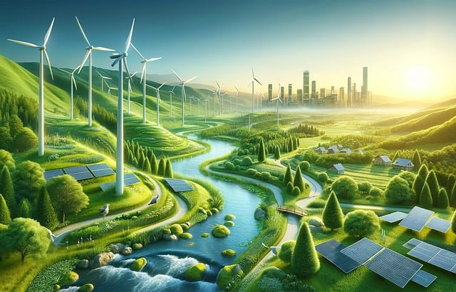

# sostenibilidad

## U1: La sostenibilidad y el desarrollo sostenible

1. Introducción
2. Sostenibilidad y desarrollo sostenible
3. ¿Qué significa la sigla ASD?
4. La agenda 2030 y los ODS
5. Marco normativo y regulador de la sostenibilidad en Europa
6. Evaluación del desempeño en sostenibilidad de las empresas.

Referencias

